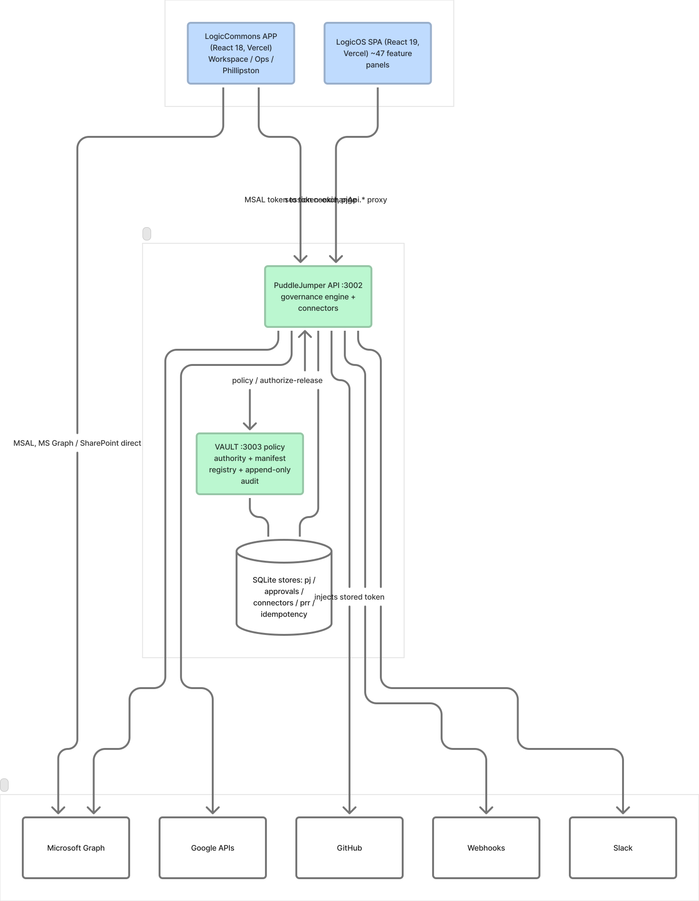
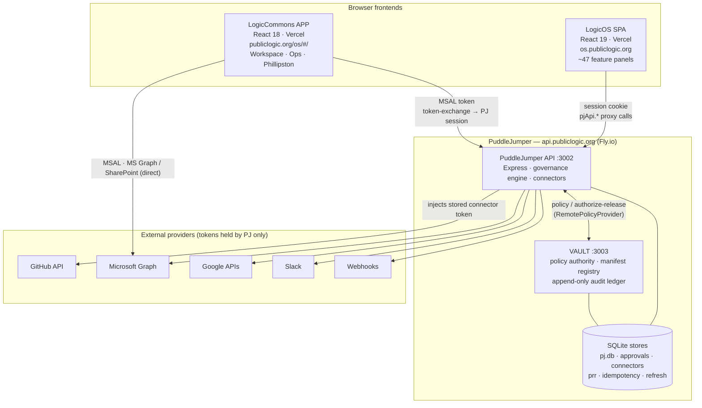
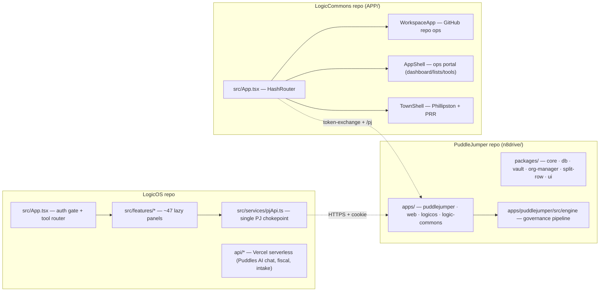
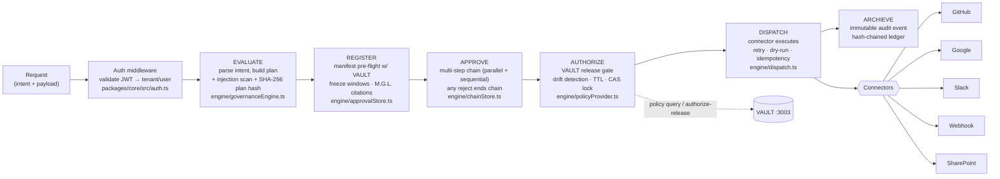
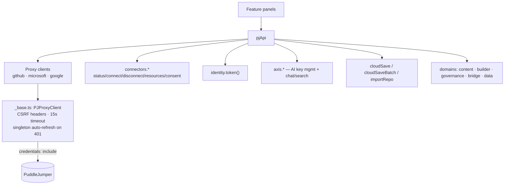
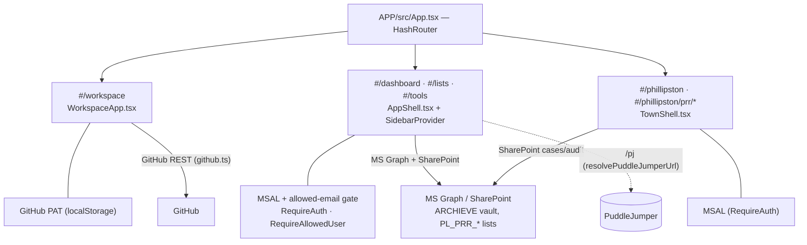

# PublicLogic Platform — Full Map

> A complete architecture map of the PublicLogic municipal-governance platform across
> its three repositories: **LogicOS** (operator frontend), **PuddleJumper** (governed
> execution runtime + backend), and **LogicCommons** (operations app + shared
> primitives).
>
> Generated 2026-05-28. Branch: `claude/full-map-QcRIa`.

> Standalone editable version (FigJam): https://www.figma.com/board/FiPDH8ADUA5yEON4Ak7teJ

---

## 1. The three repositories at a glance

| Repo | Role | Stack | Deploy | Live URL |
|------|------|-------|--------|----------|
| **LogicOS** (`97n8/logicos`) | React + Vite SPA — the operator workspace. Pure frontend; no app server. | React 19, Vite 7, TS 5.9, Tailwind 4, React Query, Radix/shadcn | Vercel (+ a handful of Vercel serverless functions under `api/`) | `os.publiclogic.org` → `logicos-rho.vercel.app` |
| **PuddleJumper** (`97n8/puddlejumper`) | **GPR — Government Process Runtime.** Fail-closed governance engine, connector dispatch, OAuth broker, VAULT authority. The only thing that holds provider tokens. | Node 20, Express 4, pnpm + Turbo monorepo (`n8drive/`), better-sqlite3, jose; Next.js `web/` | Fly.io (Docker) — PJ on `:3002`, VAULT on `:3003` | `api.publiclogic.org` |
| **LogicCommons** (`97n8/logiccommons`) | Operations app: GitHub repo workspace + ops portal + the **Phillipston** governed town environment (Public Records Requests). Canonical app lives in `APP/`. | React 18, Vite 7, TS 5.9, MUI + Radix, MSAL, MS Graph, SharePoint, React Query | Vercel (build from `APP/`), GitHub Pages for legacy component library | `publiclogic.org/os/#/` |

**One-line mental model:** LogicOS and LogicCommons are browser frontends. Neither
touches an OAuth provider directly. Every privileged action — GitHub, Microsoft Graph,
Google, Slack, webhooks — is brokered by **PuddleJumper**, which holds tokens
server-side and runs every governed action through a fail-closed approval pipeline
before it executes. **VAULT** is the policy/authority + immutable-audit layer behind PJ.

---

## 2. System context

**Key boundary facts**
- **No provider tokens in any browser.** LogicOS holds only a PJ session cookie
  (HTTP-only, Secure, SameSite=Lax). All provider traffic goes through `pjApi.*`.
- LogicCommons is the partial exception: it authenticates with **Azure MSAL** in the
  browser and calls **Microsoft Graph / SharePoint directly** for its ops surfaces,
  while also bridging into PJ via `/api/auth/token-exchange` for governed actions.
- VAULT is optional at runtime: if `VAULT_URL` is set, PJ uses `RemotePolicyProvider`;
  otherwise a `LocalPolicyProvider` (SQLite) ships inside PJ. Swapping is config, not code.

---

## 3. Repository topology

---

## 4. PuddleJumper — the governed runtime

### 4.1 Monorepo layout (`n8drive/`, pnpm + Turbo)

**Apps**
- `apps/puddlejumper` (`@publiclogic/puddlejumper`) — main API server, governance engine, connectors. Entry: `src/api/server.ts`, port **3002**.
- `apps/web` (`@pj/web`) — Next.js 15 / React 19 admin frontend.
- `apps/vault` / `packages/vault` (`@publiclogic/vault`) — policy authority, manifest registry, audit ledger. Entry: `src/server.ts`, port **3003**.
- `apps/logicos` (`@gpr/logicos`) — Vite/React 18 mobile operator shell.
- `apps/logic-commons` (`@publiclogic/logic-commons`) — shared OAuth/session lifecycle, token-exchange, migrations.

**Packages**
- `packages/core` (`@publiclogic/core`) — JWT (jose), cookies, auth middleware, shared types.
- `packages/db` (`@pj/db`) — canon SQLite handle + schema (better-sqlite3).
- `packages/org-manager` (`@pj/org-manager`), `packages/split-row` (`@pj/split-row` — overlay/divergence loader), `packages/ui` (`@pj/ui`).

### 4.2 The fail-closed governance pipeline

Every municipal AI action passes through the engine before anything executes. **Default
deny.** Intents are classified **launcher** (low-risk, immediate), **governed** (needs an
approval chain), or **legacy**.

**HTTP surface (selected)** — base `/api` on PJ `:3002`:
- Auth/session: `POST /login`, `POST /refresh`, `POST /auth/logout`, `GET /me`, `GET /identity`, `POST /auth/change-password`, `POST /auth/token-exchange` (MSAL → PJ session).
- OAuth: `GET /auth/{github|google|microsoft}/login` + `/callback`.
- Governance: `POST /evaluate`, `POST /pj/execute`, `GET /pj/identity-token`.
- Approvals: `GET /approvals`, `POST /approvals/:id/decide`, `POST /approvals/:id/dispatch`, `GET /approvals/:id/chain`.
- Connectors: `POST /connectors/:provider/auth/start` + `/callback`, `POST /connectors/:provider/disconnect`, `GET /connectors/:provider/resources`, `GET /connectors/consent`.
- Provider proxies: `/github/*`, `/microsoft/*`, `/google/*` (PJ injects the stored token).
- PRR: `POST /prr/intake`, `GET /api/public/prr/*` (anonymous).
- Health: `/health` (deep: DB + volume + secrets), `/ready` (shallow DB ping).

### 4.3 Connectors / dispatchers

`engine/dispatch.ts` holds a `DispatcherRegistry`; each connector implements a standard
`ConnectorDispatcher` (health check, rate-limit awareness, retry, dry-run):
- `dispatchers/github.ts` — branch/commit/PR (5000/hr limit)
- `dispatchers/google.ts` — Drive upload, permissions
- `dispatchers/slack.ts` — messages/channels
- `dispatchers/webhook.ts` — arbitrary HTTP POST
- `dispatchers/sharepoint.ts` — upload + permissions

### 4.4 VAULT (authority + compliance)

Entry `packages/vault/src/server.ts` (`:3003`). Append-only **audit ledger**
(`auditLedger.ts`), **manifest registry** tracking deploy lifecycle
(registered → approved → authorized → deployed, `manifestRegistry.ts`), FormKey-indexed
process packages, and `VaultPolicyProvider`. Routes under `/api/v1/vault/*`
(`check-authorization`, `authorize-release`, `manifests/register`, `audit`, `formkey/:key`, …).

### 4.5 Persistence

SQLite throughout (WAL · synchronous=NORMAL · wal_autocheckpoint=1000), under
`CONTROLLED_DATA_DIR` (Fly volume `pj_data` → `/app/data`): canon `pj.db`, plus
`approvals.db`, `connectors.db`, `prr.db`, `idempotency.db`, `rate_limit.db`,
`refresh_tokens.db`, `oauth_state.db`; VAULT keeps its own `audit.db` / `manifests.db`.

### 4.6 Signature features (see `FEATURES.md`)

Idempotency store with in-flight dedup · refresh-token family rotation w/ replay
revocation · compare-and-swap dispatch lock · deterministic plan hashing · prompt-injection
detection · SSRF-safe canonical fetcher · statutory retention map (M.G.L.) · charter
validation (authority/accountability/boundary/continuity) · tier-based quotas · Prometheus-
compatible in-process metrics.

---

## 5. LogicOS — operator frontend

### 5.1 Shell & routing
- `src/main.tsx` wraps `ErrorBoundary → QueryClient → ColorProvider → AuthProvider → CloudSaveProvider → BrowserRouter`.
- `src/App.tsx` (~1080 lines) is the **auth gate + tool router**: `LoadingSpinner → LoginPage/TownLoginPage → app shell`. URL → `activeTool` via `PATH_TO_TOOL`; ~47 panels are lazy-loaded behind `Suspense`. `canUseTool()` enforces role + membership tool grants; mobile gating via `MOBILE_BLOCKED_TOOLS` / `MOBILE_NUDGE_TOOLS`.

### 5.2 The PJ chokepoint — `src/services/pjApi.ts`

Auth lives in `src/services/auth/AuthContext.tsx` (`PJUser` from `/api/me`, OAuth
redirect via `pjUrl(...)`). Base URL from `VITE_PJ_API_URL` (default
`https://api.publiclogic.org`). Domain modules under `src/services/pj/`
(`content`, `builder`, `governance`, `bridge`, `data`).

### 5.3 Feature surface (~47 panels under `src/features/`)
Governed environments & ops: `vault`, `casespaces`/`environments`, `civic`, `civicpulse`/`watchlayer`, `records` (FOIA), `permitting`/`permitbridge`, `procurement`, `budgeting`, `capitalprojects`/`cgm`, `staffhr`, `time`, `clerk`, `boardcompliance`, `intake`, `evidence`, `routingengine`, `flows` (automations), `formkey`, `logiccommons`, `logicbridge`, `logicdash`, `marketplace`, `orgmanager`, `govai`, `puddles` (AI chat via MCP), `comms`, `onboard`/`quickstart`, `admin`/`audit`/`devtools`/`syncronate`, plus town/demo surfaces (`town`, `townfinder`, `aed`, `stay`, `vaultmgl`).

### 5.4 Vercel serverless (`api/`)
`puddles/chat.ts` (Anthropic + Vercel AI SDK, streams over MCP/SSE, 60s), `civic/staff.ts`,
`fiscal/municipalities.ts`, `fiscal/sync.ts`, `health/anthropic.ts`, `logicos/intake.ts`
(Zod-validated webhook → records), `logicos/records/[index|[id]].ts`.

---

## 6. LogicCommons — operations app (`APP/`)

Three surfaces merged under one **HashRouter** (`APP/src/App.tsx`):

- **Repository Workspace** (`#/workspace`) — GitHub repo ops (issues, PRs, CI, files, registry, vault) via `src/github.ts`; token in localStorage.
- **Operations Portal** (`#/dashboard`, `#/lists`, `#/tools`, inbox, pipeline, …) — `AppShell.tsx` + sidebar, command palette, global capture. Microsoft Graph (`app/lib/graph-api.ts`) + SharePoint (`app/lib/sharepoint-client.ts`, `archieve.ts`). Pages in `src/app/pages/` (`Dashboard.tsx`, `Lists.tsx`, `Pipeline.tsx`, `Playbooks.tsx`, …).
- **Phillipston governed environment** (`#/phillipston`, `#/phillipston/prr/*`) — `TownShell.tsx`; CaseSpace + **PRR = Public Records Requests** (M.G.L. c. 66 §10, 10-business-day deadline). Components under `src/app/environments/phillipston/prr/` — `ResidentSubmission.tsx`, `StaffCaseSpace.tsx`, `StaffIntake.tsx`. SharePoint lists `PL_PRR_Cases`, `PL_PRR_Audit`.

**Auth**: Azure MSAL (`src/auth/msalInstance.ts`, scopes `User.Read`, `Calendars.Read.Shared`, `Sites.ReadWrite.All`), gates `RequireAuth` / `RequireAllowedUser`, config resolver `publiclogicConfig.ts` (also resolves the PJ URL, default `/pj` or `VITE_PJ_BASE_URL`).

**Deploy**: `vercel.json` builds from `APP/` → `APP/dist`; `.github/workflows/app-build.yml` lints/typechecks/tests/builds on `APP/**`; `pages.yml` ships the legacy `.legacy/component-library-v4` to GitHub Pages. Migration history in `APP/CLEANUP_PLAN.md` (Phase 5 cleanup ongoing); `migration-backups/` holds archived root config.

---

## 7. End-to-end flows

### 7.1 Login & connector OAuth (LogicOS)
1. User picks a provider on `LoginPage`.
2. `AuthContext.login(provider)` → redirect to `${PJ}/api/auth/{provider}/login`.
3. PJ runs the full OAuth dance, stores the token **server-side**, sets its session cookie.
4. PJ redirects back with `?auth=success`; `AuthContext` calls `${PJ}/api/me` to hydrate the user.
5. Connector OAuth (`/api/connectors/:provider/auth/start`) is a *separate* flow that stores per-(tenant,user,provider) tokens for proxied calls.

### 7.2 SSO bridge (LogicCommons → PJ)
LogicCommons authenticates with MSAL in the browser, then `POST /api/auth/token-exchange`
with the MS Graph access token; PJ verifies and issues its own session — SSO across
independently deployed apps without a shared session store.

### 7.3 A governed action
`pjApi`/intake → `POST /evaluate` (plan + hash + injection scan) → register w/ VAULT
manifest → approval chain → VAULT `authorize-release` (drift/TTL) → CAS-locked dispatch to
a connector → ARCHIEVE audit event.

---

## 8. Hard constraints (do not violate)

1. **No direct provider API calls from the LogicOS browser** — always `pjApi`.
2. **No tokens in `localStorage`/`sessionStorage`** for LogicOS — PJ session cookie only. (LogicCommons workspace is the deliberate exception: GitHub PAT in localStorage.)
3. **No new legacy LogicOS service files** (`microsoft365.ts`, `google.ts` were removed on purpose).
4. **CORS**: PJ's `CORS_ALLOWED_ORIGINS` must include any new Vercel preview origin.
5. **OAuth callbacks**: changing a frontend URL means updating PJ's `LOGIC_COMMONS_URL` / `PJ_PUBLIC_URL` Fly secrets.
6. **Governance is fail-closed** — never add a path that dispatches a governed intent without passing the pipeline.

---

## 9. Ports, URLs & env quick-reference

| What | Value |
|------|-------|
| PJ API | `:3002` · `api.publiclogic.org` |
| VAULT | `:3003` (optional via `VAULT_URL`) |
| LogicOS dev | `:5173` → `VITE_PJ_API_URL=http://localhost:3002` |
| LogicCommons APP dev | `:3000` (Vite) |
| PJ data dir | `CONTROLLED_DATA_DIR` (Fly volume `pj_data` → `/app/data`) |
| PJ auth env | `JWT_SECRET`, `AUTH_ISSUER=puddle-jumper`, `AUTH_AUDIENCE=puddle-jumper-api`, `MS_/GOOGLE_/GITHUB_CLIENT_*` |
| Puddles AI | `ANTHROPIC_API_KEY`, `PJ_MCP_URL=…/mcp/sse` |

---

*This map is a synthesis of the three repos' READMEs, `ARCHITECTURE.md`, `FEATURES.md`,
`PRD.md`, env references, and a direct read of the source trees. For day-to-day specifics,
each repo's `.github/copilot-instructions.md` and the files referenced above remain
authoritative.*
