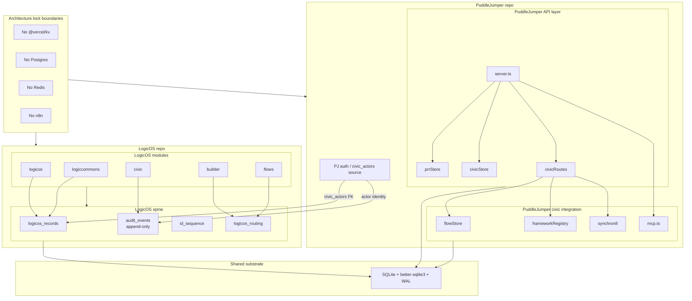

# LogicOS + PuddleJumper Architecture Map

- **Substrate:** both repos run on SQLite with `better-sqlite3` and WAL, not a hosted KV or external queue/database substrate.
- **Append-only audit:** `audit_events` is treated as immutable history, with no-update and no-delete triggers enforcing append-only behavior.
- **Runtime routing:** `logicos_routing` and the civic framework registry decide where work goes at runtime instead of hard-coding destinations into UI state.
- **AI assist, not decide:** scenario and workflow tooling can draft, classify, and suggest, but human review gates remain explicit in the flow graph and operator workflow.
- **Municipal data ownership:** records, routing state, and civic actor references stay in municipal-controlled application storage; integrations move data under operator-visible rules rather than taking ownership away.
